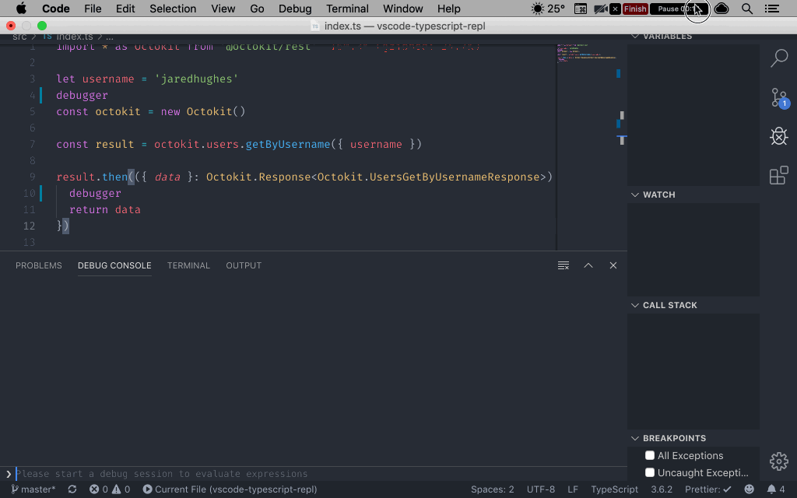
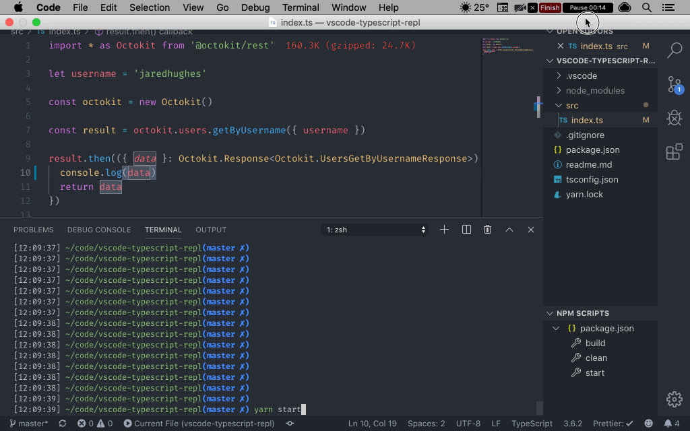

# VSCode TypeScript REPL

## Requirements

- VSCode
- Node >= 8.15
- Yarn

## Setup

- Run `yarn` to install dependencies
- Open project in VSCode

## Usage

### VSCode Debug

- Open `src/index.ts`
- `⇧⌘D` to open Debug panel
- `⇧⌘Y` to open Debug Console
- In debug options dropdown, select "Debugger Examples" and <kbd>F5</kbd> or click "Debug ▷"

---

### Terminal/Console Watch Mode

- Open `src/index.ts`
- Open VSCode terminal
- Run `yarn start`
- Edit and save file changes, restarting nodemon and logging any new console messages

